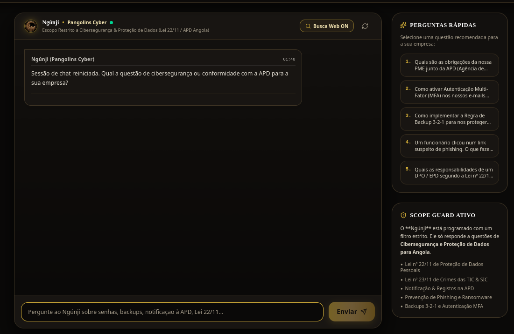
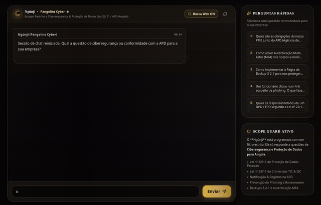
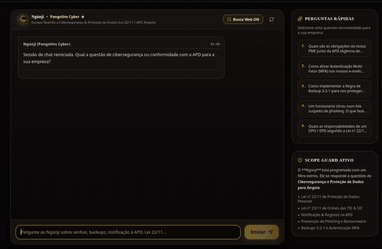

<div align="center">


# 🛡️ Ngúnji — by Pangolins Cyber

### Copiloto de Ciber-higiene e Proteção de Dados para PMEs Angolanas

**Especialista em Lei n.º 22/11, Lei n.º 23/11 e Orientações da APD**

[](#-sobre-o-projeto)
[](#-licença)
[](#-stack-tecnológico)
[](#-roadmap)

</div>

---

## 📑 Índice

- [Sobre o Projeto](#-sobre-o-projeto)
- [Funcionalidades](#-funcionalidades)
- [Capturas de Ecrã](#-capturas-de-ecrã)
- [Vídeos de Demonstração](#-vídeos-de-demonstração)
- [Stack Tecnológico](#-stack-tecnológico)
- [Como Executar Localmente](#-como-executar-localmente)
- [Deploy em Produção](#-deploy-em-produção)
- [Estrutura do Projeto](#-estrutura-do-projeto)
- [Documentação Legal e de Conformidade](#-documentação-legal-e-de-conformidade)
- [Enquadramento Legal](#-enquadramento-legal)
- [Roadmap](#-roadmap)
- [Autor](#-autor)
- [Licença](#-licença)

---

## 🎯 Sobre o Projeto

O **Ngúnji** ("segurança", em Kimbundu) é um agente inteligente conversacional criado no âmbito do desafio **Alura Agente**, com o objetivo de tornar a ciber-higiene e a conformidade com a proteção de dados **acessíveis a Pequenas e Médias Empresas angolanas** que, na maioria dos casos, não têm equipa de TI ou jurídica dedicada.

O agente combina um modelo de linguagem (Google Gemini) com uma **base de conhecimento normativa própria (RAG)** — legislação angolana, orientações da APD e normas internacionais (NIST CSF, CIS Controls) — para fornecer respostas fundamentadas, citando sempre a fonte legal aplicável.

O projeto integra-se na iniciativa **Pangolins Cyber**, focada em segurança da informação e conformidade legal para o tecido empresarial angolano.

---

## ⚙️ Funcionalidades

- 💬 **Chat Ngúnji** — assistente conversacional especializado, com histórico de conversa e sugestões de perguntas rápidas;
- 🔒 **Scope Guard** — filtro que garante que o agente responde **exclusivamente** a questões de ciber-higiene, segurança da informação e proteção de dados, recusando de forma transparente qualquer pergunta fora do domínio;
- 📚 **Base RAG Explorer** — explorador da base de conhecimento normativa (Lei n.º 22/11, Lei n.º 23/11, orientações da APD, manual de DPO/EPD, NIST CSF/CIS Controls), pesquisável por artigo ou termo;
- 📊 **Diagnóstico & Score** — questionário de autoavaliação de 10 pilares de segurança (senhas, MFA, backups, phishing, etc.), com cálculo de *Cyber Hygiene Score* (0–100) e plano de ação priorizado;
- 🏢 **Perfil PME** — personalização das respostas com base no perfil da empresa (dimensão, sector, província, plataforma de nuvem utilizada);
- 🌐 **Busca Web** — opção de fundamentar respostas com pesquisa em tempo real, quando ativada.

---

## 🖼️ Capturas de Ecrã

<table>
<tr>
<td width="50%">

**Chat Ngúnji — Scope Guard Ativo**


</td>
<td width="50%">

**Base RAG Explorer**


</td>
</tr>
<tr>
<td width="50%">

**Diagnóstico de Ciber-higiene & Conformidade APD**


</td>
<td width="50%">

**Pergunta Dentro do Escopo — Resposta Fundamentada**


</td>
</tr>
<tr>
<td width="50%" colspan="2">

**Pergunta Fora do Escopo — Scope Guard em Ação**


</td>
</tr>
</table>

---

# 🎬 Vídeos de Demonstração
 
> Pré-visualização em GIF (excerto). Clica no link por baixo de cada uma para ver o vídeo `.mp4` completo.
 
**Teste de funcionamento 1 — Fluxo de diagnóstico e chat:**
 

▶️ [Ver vídeo completo (Teste 1.mp4)](https://github.com/Israzuba0023/Pangolins-Challenge-Alura-Agente/blob/main/assets/Teste%201.mp4)
 
**Teste de funcionamento 2 — Scope Guard e Base RAG:**
 

▶️ [Ver vídeo completo (Teste 2.mp4)](https://github.com/Israzuba0023/Pangolins-Challenge-Alura-Agente/blob/main/assets/Teste%202.mp4)
 

---

## 🧰 Stack Tecnológico

| Camada | Tecnologia |
| :--- | :--- |
| Frontend | React + Vite + Tailwind CSS |
| Backend | Node.js + Express (`server.ts`) |
| IA / LLM | Google Gemini API |
| Agente alternativo (CLI/API) | Python + FastAPI (`python_agent/`) |
| Base de Conhecimento | RAG normativo próprio (Lei n.º 22/11, Lei n.º 23/11, APD, NIST CSF, CIS Controls) |
| Deploy | Oracle Cloud Infrastructure (OCI) / Docker / PM2 + Nginx |

---

## 🚀 Como Executar Localmente

### Pré-requisitos
- **Node.js** 18.x ou superior ([download](https://nodejs.org/))
- **npm**, **pnpm**, **yarn** ou **bun**
- **Git**
- Uma **Chave de API do Google Gemini**, obtida gratuitamente no [Google AI Studio](https://aistudio.google.com/)

### Passo a passo

1. **Clonar o repositório**
   ```bash
   git clone https://github.com/Israzuba0023/Pangolins-Challenge-Alura-Agente.git
   cd Pangolins-Challenge-Alura-Agente
   ```

2. **Configurar as variáveis de ambiente**
   Crie um ficheiro `.env` na raiz do projeto (pode copiar o `.env.example`):
   ```bash
   cp .env.example .env
   ```
   E edite o `.env` com a sua chave:
   ```env
   GEMINI_API_KEY=sua_chave_gemini_aqui
   PORT=3000
   NODE_ENV=development
   ```
   > ⚠️ Nunca envie o seu `.env` para o Git público — já está protegido pelo `.gitignore`.

3. **Instalar as dependências**
   ```bash
   npm install
   ```

4. **Iniciar o servidor de desenvolvimento**
   ```bash
   npm run dev
   ```
   Aceda em **http://localhost:3000**.

### Scripts disponíveis

| Comando | Descrição |
| :--- | :--- |
| `npm run dev` | Inicia o backend Express + Vite em modo de desenvolvimento (hot-reload) |
| `npm run build` | Compila o frontend (`dist/`) e o backend TypeScript |
| `npm run start` | Executa o build de produção |
| `npm run lint` | Valida a tipagem TypeScript |

---

## ☁️ Deploy em Produção

O projeto suporta múltiplas opções de deploy — detalhes completos em [`REQUIREMENTS.md`](./REQUIREMENTS.md):

- **VPS Linux (Ubuntu/Debian)** com PM2 + Nginx como proxy reverso;
- **Docker** (`Dockerfile` multi-stage incluído);
- **Oracle Cloud Infrastructure (OCI)** — ver [`deployment/oci`](./deployment/oci);
- **Plataformas de nuvem** (Render, Railway, Fly.io, Google Cloud Run).

---

## 📂 Estrutura do Projeto

```
├── assets/                  # Capturas de ecrã, vídeos e imagens de marca
├── docs/                    # Documentação legal e de conformidade (ver secção abaixo)
├── deployment/oci/          # Scripts e configuração de deploy na Oracle Cloud
├── src/
│   ├── assets/               # Imagens e logótipos usados na aplicação
│   ├── components/           # Componentes React (Header, Chat, Diagnóstico, RAG, etc.)
│   ├── data/                 # Base RAG (Lei n.º 22/11, APD, NIST)
│   ├── types.ts               # Interfaces TypeScript
│   ├── App.tsx                 # Componente principal e rotas
│   └── main.tsx                 # Ponto de entrada React
├── python_agent/             # Agente alternativo em Python (FastAPI)
├── tests/                    # Testes automatizados
├── .github/workflows/        # Integração contínua (CI)
├── server.ts                 # Servidor Express + API Gemini + RAG Search
├── package.json
├── vite.config.ts
└── .env.example
```

---

## 📄 Documentação Legal e de Conformidade

A pasta [`docs/`](./docs) reúne a documentação de conformidade do projeto, alinhada com a Lei n.º 22/11 e as orientações da APD:

- [Política de Privacidade e Proteção de Dados](./docs/politica-de-privacidade.md)
- [FAQ — Ameaças Comuns (Phishing, Ransomware, Engenharia Social)](./docs/faq-ameacas-comuns.md)
- [Guia de Boas Práticas de Segurança para PMEs](./docs/guia-boas-praticas.md)
- [Checklist de Resposta a Incidentes](./docs/checklist-resposta-incidentes.md)
- [Termos de Uso do Agente](./docs/termos-de-uso.md)

---

## ⚖️ Enquadramento Legal

O Ngúnji fundamenta as suas respostas em:

- **Lei n.º 22/11, de 17 de Junho** — Proteção de Dados Pessoais de Angola;
- **Lei n.º 23/11** — Crimes no Domínio das Tecnologias da Informação;
- **Orientações e Circulares da Agência de Proteção de Dados (APD)** — [www.apd.ao](https://www.apd.ao);
- **NIST Cybersecurity Framework 2.0** e **CIS Controls v8** como referências internacionais complementares.

---

## 🗺️ Roadmap

- [ ] Deploy contínuo na Oracle Cloud Infrastructure (OCI)
- [ ] Ampliação da base RAG normativa
- [ ] Autenticação de utilizadores / gestão de perfis de empresa
- [ ] Exportação de relatórios de diagnóstico em PDF

---

## 👤 Autor

**Israel Cassute (Zuba)**
Estudante de Engenharia Informática e Comunicação — Universidade Óscar Ribas (Luanda, Angola)
Cibersegurança, IA e formação técnica

---

## 📜 Licença

Este projeto está licenciado sob os termos da licença **MIT** — consulte o ficheiro `LICENSE` para mais detalhes.
